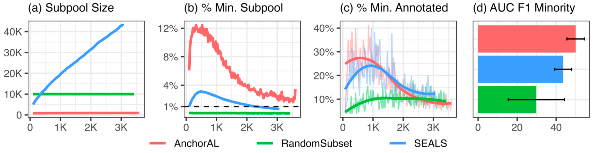

# AnchorAL: Computationally Efficient Active Learning for Large and Imbalanced Datasets

<font size = "3">*Pietro Lesci \& Andreas Vlachos*</font>

<br>

This is the official PyTorch implementation for our NAACL 2024 paper: "AnchorAL: Computationally Efficient Active Learning for Large and Imbalanced Datasets".

[](https://arxiv.org/abs/2404.05623)

> **Abstract:** Active learning for imbalanced classification tasks is challenging as the minority classes naturally occur rarely. Gathering a large pool of unlabelled data is thus essential to capture minority instances. Standard pool-based active learning is computationally expensive on large pools and often reaches low accuracy by overfitting the initial decision boundary, thus failing to explore the input space and find minority instances. To address these issues we propose AnchorAL. At each iteration, AnchorAL chooses class-specific instances from the labelled set, or anchors, and retrieves the most similar unlabelled instances from the pool. This resulting subpool is then used for active learning. Using a small, fixed-sized subpool AnchorAL allows scaling any active learning strategy to large pools. By dynamically selecting different anchors at each iteration it promotes class balance and prevents overfitting the initial decision boundary, thus promoting the discovery of new clusters of minority instances. Experiments across different classification tasks, active learning strategies, and model architectures AnchorAL is (i) faster, often reducing runtime from hours to minutes, (ii) trains more performant models, (iii) and returns more balanced datasets than competing methods.



Experimental artefacts and datasets are available on the [HuggingFace Hub](https://huggingface.co/collections/pietrolesci/anchoral-66103ace42da659656c635d2).
To reproduce our experiments, read below.


> [!TIP]
> AnchorAL is also implemented and available through the [small-text](https://github.com/webis-de/small-text) library. Check it out!


## 1. Setup

First, clone this repo with its submodules

```bash
git clone --recurse-submodules https://github.com/pietrolesci/anchoral.git
```

Then, install conda

```bash
curl -sL \
  "https://repo.anaconda.com/miniconda/Miniconda3-latest-Linux-x86_64.sh" > \
  "Miniconda3.sh"
bash Miniconda3.sh -b -p
rm Miniconda3.sh
source $HOME/miniconda3/bin/activate
conda init zsh
```

and poetry.

```bash
curl -sSL https://install.python-poetry.org | python3 -
```

Finally, create a new environment with conda and use poetry to install the dependencies.

```bash
conda create -n anchoral python=3.9 -y
conda activate anchoral
poetry install --sync --with dev
```


## 2. Data Preparation

First, download the processed data from the hub run

```bash
./bin/download_data_from_hub.sh
```

or re-process the data locally (this indexes the data with 3 sentence-transformers -- takes a long time!).

```bash
./bin/download_and_process_data.sh
```

Second, create a local HNSW index. 
To speed up the experimentation, we create the HNSW index once and save it to disk.
For each embedding in the dataset, this will save a different `.bin` file. 
By default, it will create indices using the cosine distance, change this file if you want to experiment with different metrics. 

```bash
./bin/create_index.sh
```

Finally, prepare the data for training, that is, tokenize and save the dataset so it is ready to go.

```bash
./bin/prepare_data.sh bert-base-uncased
```

At the end of the data preparations, you should have the following folder structure.

```bash
./data
├── prepared
│   ├── agnews-business-.01_bert-base-uncased
│   ├── amazoncat-agri_bert-base-uncased
│   ├── amazoncat-multi_bert-base-uncased
│   └── wikitoxic-.01_bert-base-uncased
└── processed
    ├── agnews
    ├── amazoncat-13k
    └── wikitoxic
```


## 3. Run experiments

You can replicate our experiments by looking at the files `./bin/run_main_experiments`, `./bin/run_ablations`, and `./bin/run_other_models` (more instructions in those files).
Once you run these experiments, you should obtain the following folder structure.

```bash
./outputs
├── ablations
│   ├── anchor_strategy
│   │   ├── bert-base-uncased_anchoral_badge_2023-12-08T18-23-01_36952945_1
│   │   ├── bert-base-uncased_anchoral_badge_2023-12-08T18-23-01_36952945_2
│   │   ├── ...
│   ├── num_anchors
│   └── num_neighbours
├── main
│   ├── agnews-business-.01
│   ├── amazon-agri
│   ├── amazon-multi
│   └── wikitoxic-.01
└── other_models
    ├── albert-base-v2
    ├── bert-tiny
    ├── deberta-v3-base
    ├── gpt2
    └── t5-base
```

Each run has the following folder structure.

```bash
├── active_train.log
├── .early_stopping.jsonl
├── hparams.yaml
├── logs
│   ├── labelled_dataset.parquet
│   ├── ... (optionally, based on the strategy)
├── tb_logs
│   └── version_0
│       └── events.out.tfevents.xxx
└── tensorboard_logs.parquet
```

If you limit the time of each run, some files may be not deleted and tensorboard logs are not exported to parquet.
In those cases, use the `./notebooks/01_check_runs.ipynb` to manually export it and possibly delete other (big) files and folders (e.g., `.checkpoints` and `model_cache`) that are not needed.


If you want to run new experiments, consider that we use hydra for configuration. 
Thus, to run more experiments in parallel, you can assign comma-separate options, e.g. `SEEDS=654321,123456`.

```bash
# select from: 654321, 123456
SEEDS=654321

# select from: agnews_business, amazon_agri,amazon_multi, wikitoxic
DATASET=agnews_business

# select from: bert-base-uncased, bert-tiny, deberta-v3-base, albert-base-v2, gpt2, t5-base
MODEL=bert-base-uncased

# select from: {anchoral, randomsubset, seals}_{entropy, badge, ftbertkm} or random
STRATEGY=anchoral_entropy

# assign a name to the experiment
EXPERIMENT_GROUP=main

# run experiment
poetry run python ./scripts/active_train.py -m \
    experiment_group=$EXPERIMENT_GROUP \
    model.name=$MODEL \
    dataset=$DATASET \
    strategy=$STRATEGY \
    data.seed=$SEEDS \
    model.seed=$SEEDS \
    active_data.seed=$SEEDS
```

You might need to modify the configurations and include the absolute path to your data (if you use slurm, check also the `conf/launcher/slurm.yaml/` file).
The key to edit is `data_path: <add path>`.


## 4. Analysis

Once you have run the experiments and created the correct folder structure, as described in the previous section, you can run the analysis.

First, run the `notebooks/01_check_runs.ipynb` to make sure that each run has the necessary files to run the analysis.
Importantly, you need the `tensorboard_logs.parquet` files. If your run exited before exporting the tensorboard logs to parquet, you can use the notebook to do that.

Second, once you have all the `tensorboard_logs.parquet` files for each run, you can export the necessary metrics from them.
To do this, use the `notebooks/03_export_experiments.ipynb`. It will create files in the `results/` folder. These artefacts will be used in the analysis.

Finally, once you have all the artefacts in the `results/` folder, you can run the analysis.
You can do this by running the `notebooks/04_analysis.ipynb` notebooks which create the tables and plots used in the paper.


## In the press

https://www.marktechpost.com/2024/04/10/researchers-at-the-university-of-cambridge-propose-anchoral-a-unique-machine-learning-method-for-active-learning-in-unbalanced-classification-tasks/

https://medium.com/@multiplatform.ai/a-novel-approach-to-active-learning-in-imbalanced-classification-tasks-anchoral-by-university-of-c097e28e9414
